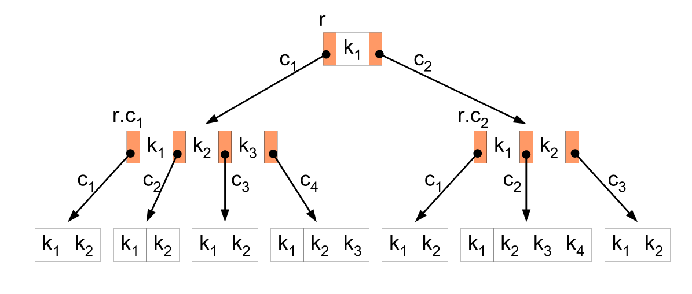

# estudo-logica
Repositório dedicado ao estudo de Lógica de Programação

# Diferença entre Arrays e Listas

Basicamente algumas linguagens tem diferenças entre arrays e listas, apesar de serem estruturas semelhantes, as listas permitem a inclusão e exclusão de itens no meio da estrutura de uma maneira mais flexível que as Arrays. No Javascript não temos estruturas de listas especificas, as listas são como arrays. Enquanto no Phyton temos estruturas de dados de Listas e Arrays separadamente. 

# Arrays

Arrays são estruturas de dados que permitem armazenar e manipular conjunto de valores. É importante saber que para se recuperar um item da lista, usamos sua posição como índice. Toda Array inicia com sua posição em 0.

## Declaração de Arrays em JS

Para se declarar uma nova array em JS usamos os colchetes [ ]:

```jsx
const lista = ["Valor1","Valor2","Valor3"]
```

Para modificar o valor de um item da lista usamos o nome da lista com o indice e igualamos ao seu valor.

```jsx
lista[0] = "Novo Valor"
```

## Métodos que podem auxiliar com Arrays

**Método Length**

Para saber a quantidade de elementos em uma Array posso usar o método length.

```jsx
lista.length // Isso irá retornar o total de itens dentro da Array
```

Para retornar o último elemento de uma lista podemos simplesmente utilizar o método length e subtrarir 1. Fazemos essa subtração porque o início dos indices nas arrays são sempre 0.

```jsx
lista[lista.lenght - 1] // Isso irá retornar o último elemento da minha lista
```

 

**Método Push**

Para adicionar um novo valor ao final da minha lista usamos o método Push

```jsx
lista.push("Valor a ser adicionado no final")
```

**Método Pop**

Para remover o último elemento do final da minha lista usamos o método Pop

```jsx
lista.pop()
```

******************************Método Includes******************************

Para verificar se um valor está incluído dentro da nossa lista podemos usar o método includes. Este método retorna um valor booleano para caso o valor exista ou não na lista.

```jsx
lista.include("Valor2") // Caso o valor exista ele retorna true caso contrario false
```

**Método map**

Este método executa uma função especifica com todos os itens de uma array. Ao final ele retorna uma NOVA lista com os valores alterados pela função.

```jsx
const numeros = [1,2,3]
const numeros_dobrados = numeros.map(num =>  num * 2)
// a Lista numeros dobrados terá os valores [2,4,6] dentro dela
```

**************************Método filter**************************

Este método irá retornar uma nova lista somente com os valores que atenderem uma verificação de uma condição.

```jsx
const numeros = [15,17,54]
const numeros_filtrados = numeros.filter(num => num < 20)
// A lista numeros_filtrados irá trazer apenas os numeros [15,17]
```

**Método find**

Este método retorna o primeiro valor encontrado na array que atende a uma condição

```jsx
const numeros [1,2,3,4,5]
console.log(numeros.find(num => num < 3))
```

# Trees ou Árvores

Árvores são estrutura de dados hierárquicas e servem para modelar e resolver problemas computacionais complexos. 

> Elas são nós conectados por linhas onde cada nó tem 0 ou mais nós filhos
> 



Exemplo de Árvore onde cada ponto é um nó e cada seta uma linha

## ******************************************Conceitos Importantes******************************************

Abaixo vamos entender alguns conceitos importantes sobre árvores.

********Nós ou Nodes********

Cada elemento de uma árvore é chamado de Nó. Cada nó pode conter dados/informações e referências para seus nós filhos

******Nó Raiz ou Root Node******

O nó superior na hierarquia é chamado de nó raiz. O Nó Raiz não possui um nó pai.

**Nó Pai ou Parent Node**

Cada nó que possui um ou mais nós filhos é chamado de nó pai. Cada nó pai está diretamente posicionado acima dos seus nós filhos na hierarquia da árvore.

**Nó Filhos ou Child Nodes**

Os nós conectados abaixo de um nó superior são chamados de Nós filhos. Cada nó pai pode ter vários Nós filhos. 

**Nós Irmãos ou Siblings Nodes**

Nós filhos do mesmo nó pai são chamados de nós irmãos. Eles compartilham o mesmo nó pai.

**Nós Folhas ou Leaf Nodes**

Os nós que não possuem nós filhos são chamados de Leaf Nodes. Estes nós são os nós terminais da árvore.

******************************Profundidade (Depth) e Altura (Height)******************************

A profundidade de um nó é o número de conexões do caminho do nó raiz até este nó. O nó raiz tem profundidade 0.

A altura de um nó é a distancia máxima entre esse nó e uma de suas folhas. A altura da árvore é a altura do nó raiz.

**Árvore Binária**

Uma árvore Binária é um tipo de árvore onde cada nó pai possui no máximo dois nós filhos, um a esquerda e outro a direita.

**Árvore Não-Binária**

Na árvore não binária cada nó pai pode ter mais de dois filhos em cada nó.